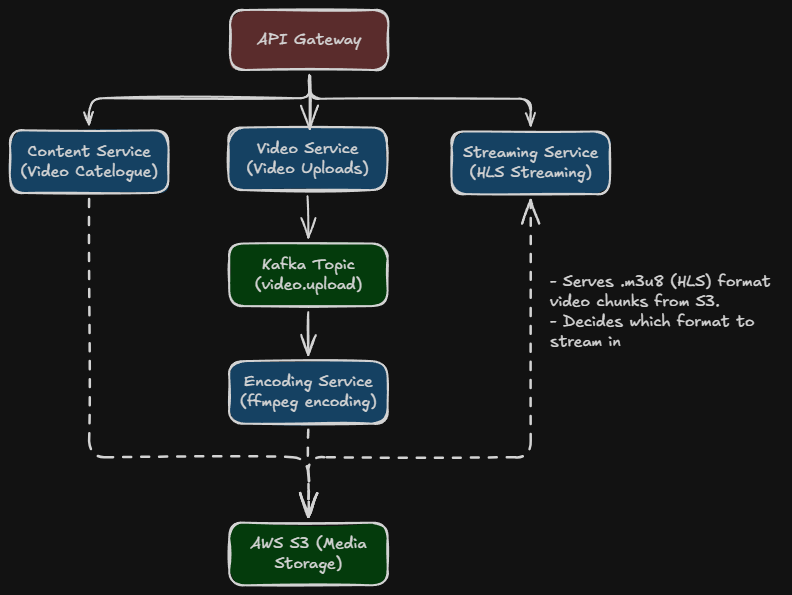

# Adaptive-HLS-Streaming-Microservice
Adaptive Bitrate HLS Streaming Architecture in Springboot Microservices Ecosystem

## HLD System Design

## Important Pointers
**User Media Access Flow**

- User requests for a media
- Streaming Service --> Private S3 Bucket (not accessible in public)
- Streaming service returns *Pre-signed URLs* with *fixed TTLs*
- User can only access the media via the signed URLs, not independently. 

**Video S3 Upload & Encoding Flow**
- Receive multipart video file
- Generate unique S3 Key
- Upload file to S3
- Publish VideoUploadedEvent to Kafka
- Encoding service picks up & starts ffmpeg encoding

**Encoding Pipeline Flow**
- Download raw video from S3
- Encode to multiple qualities using ffmpeg
- Generate HLS playlist (.ts segments) for each quality
- Create master playlist (master.m3u8 playlist) having pointers to segments for each quality
- Upload all encoded files back to S3
- Publish video.encoded event to Kafka